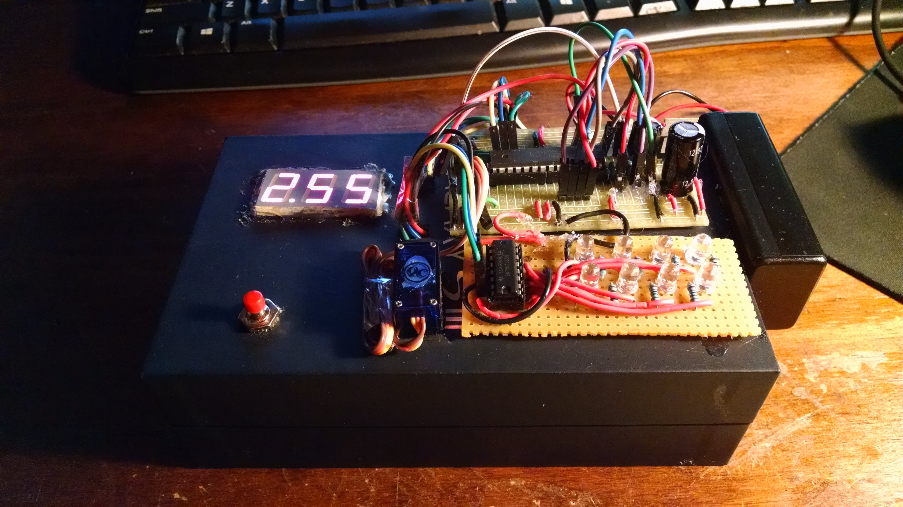

MasterMind Puzzle Box

This Arduino project is based off of the MasterMind boardgame.

https://en.wikipedia.org/wiki/Mastermind_(board_game)

It uses a voltage divider and different coloroed wires to simulate the different colored pegs used in the original game. Instead of a two
player game, the player tires to solve a randomly generated code within a preset time frame by plugging 4 (of 6 total) wire headers onto 
4 Arduino pins. When the player presses a momentary button, the program reads the voltage at the 4 chosen wires and illuminates LEDs to
inform the player. A red LED indicates that a correct color wire was chosen but that the wire is connected to the wrong pin. A green LED
indicates that a correct color wire was chosen and connected to the correct pin. If the player has solved the code, all 4 green LEDs will
illuminate and the servo arm will rotate to allow the box lid to be removed. If the player fails to solve the code within the time frame,
the program restarts and generates a new code.

Elapsed time is tracked using the SimpleTimer library and the remaining time is displayed by a 3 digit 7-segment display. The 7-segment display and the response LEDs are driven by daisy-chained sourcing serial-in, parallel-out shift registers, cycled repeatedly to take advantage of persistance of vision so as to not exceed the maximum current output of the shift registers.
